# TMS6064 Cyber Security Assignment 1
- **Name:** ZAEIM HUZAIRY  
- **Matric Number:** 25030303  
- **Course:** TMS6064 Cyber Security 

## Disclaimer
This project is conducted strictly for educational purposes only in a controlled lab environment using authorized targets.

## Setting up before starting lab

Before starting the penetration testing tasks, the DVWA (Damn Vulnerable Web Application) environment was prepared and configured in a local lab setup. This preparation ensures that all required services, applications, and configurations are functioning correctly before conducting reconnaissance and security testing activities. The setup process also provides a safe and controlled environment for learning ethical hacking and penetration testing techniques.

### Installing DVWA
This step installs the DVWA application and its required dependencies in the Linux environment.

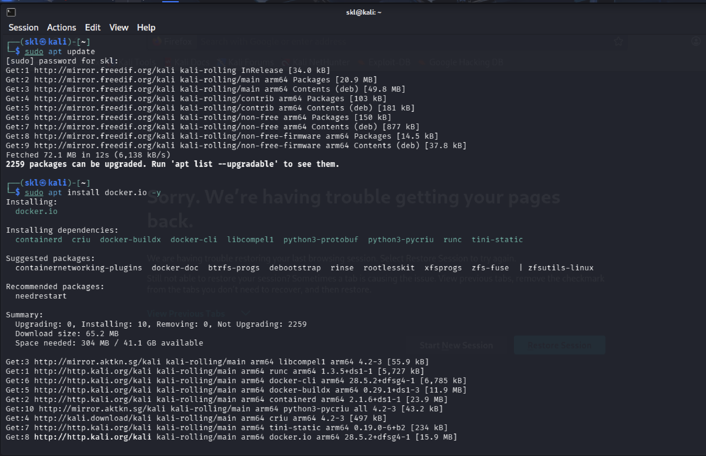

### Cloning DVWA
The DVWA source files were cloned from the official GitHub repository into the web server directory.

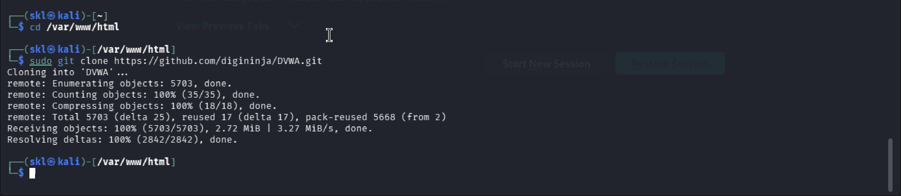

### Configuring DVWA
The configuration file was modified to connect DVWA with the local database and enable the application to run properly.

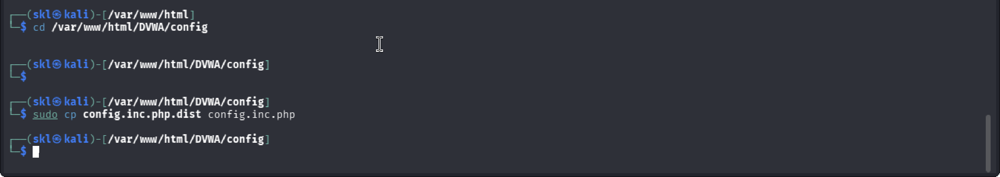

### Apache Status
The Apache web server service was checked to ensure the DVWA website could be accessed through the browser.

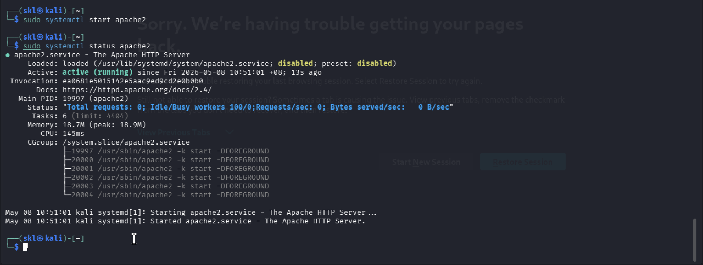

### Target IP
The target IP address and localhost environment were verified before starting reconnaissance activities.

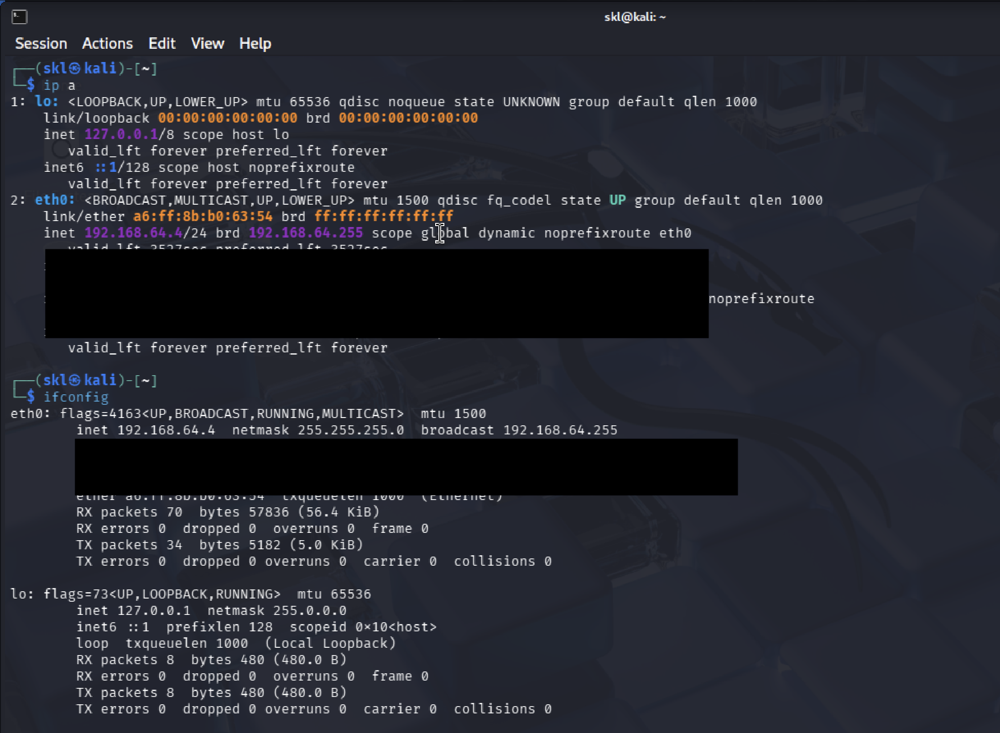

### DVWA Localhost Access
After completing the installation and configuration process, the DVWA login page was successfully accessed through the localhost environment using a web browser. This confirms that the Apache web server, PHP, and database services are functioning correctly and the DVWA application is ready for penetration testing activities.

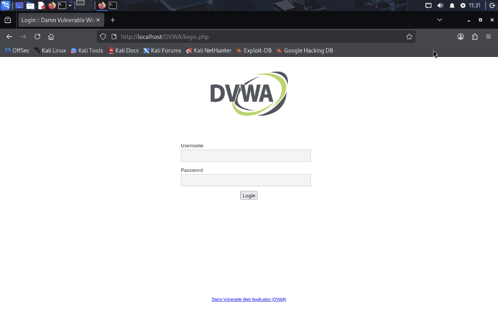


# TASK 1
Reconnaissance is the first phase in penetration testing where information is collected about the target system before conducting further security assessments. In this task, several Kali Linux reconnaissance tools were used to gather information from a locally hosted DVWA environment.

Target used in this assessment:

http://localhost/DVWA/login.php

---

## Tool 1 — Nmap

Nmap is a network scanning tool used during the reconnaissance phase in penetration testing. It helps identify open ports, running services, and operating system information on the target machine. In this task, Nmap was used to scan the locally hosted DVWA web application running on localhost.

### Installing Nmap
This step installs the Nmap tool in Kali Linux before starting the reconnaissance and scanning activities. The tool is required to perform network discovery and gather target information during penetration testing.

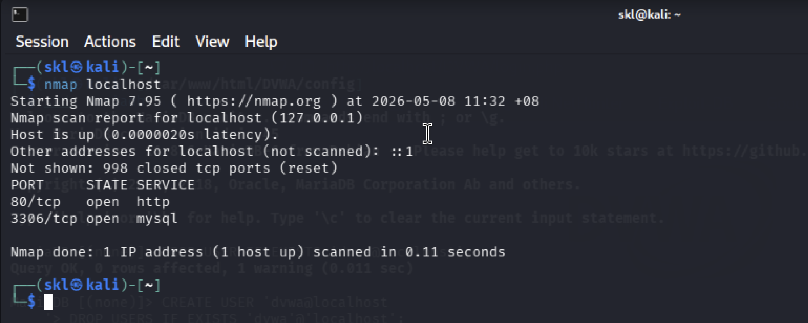

### Service Version Detection
This test is conducted to identify the versions of services running on the target machine such as Apache or HTTP services. Identifying service versions helps penetration testers understand what applications are running and whether they may contain vulnerabilities.

```bash
nmap -sV localhost
```

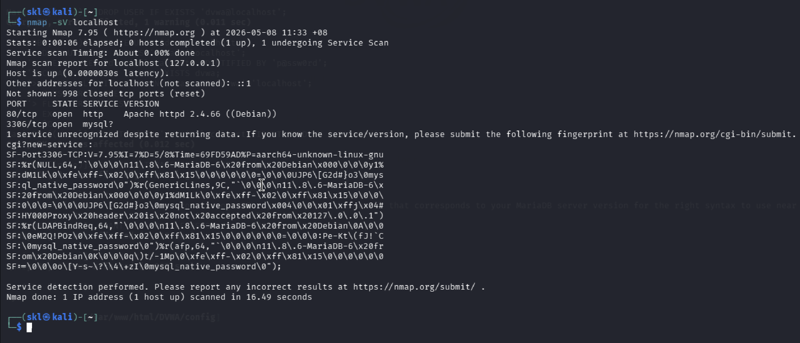

### Operating System Detection
This test is conducted to identify the operating system used by the target machine. Knowing the operating system helps penetration testers plan suitable testing methods and understand the target environment better.

```bash
sudo nmap -O localhost
```

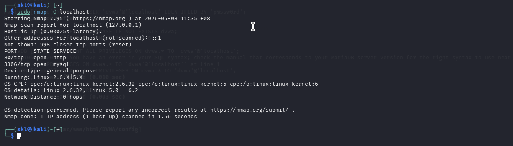

### Aggressive Scan
This test is conducted to perform more advanced reconnaissance activities including operating system detection, service version detection, script scanning, and traceroute. It helps gather more detailed information about the target before moving to the next penetration testing phase.

```bash
sudo nmap -A localhost
```

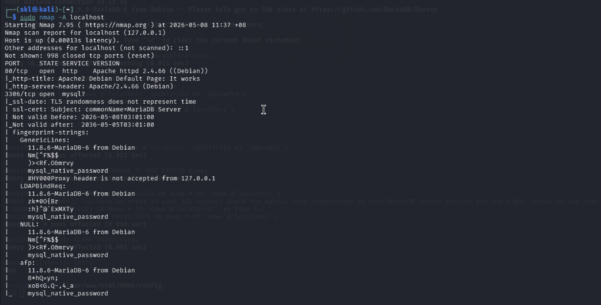

### Conclusion
Nmap successfully gathered useful information about the localhost target environment. The tool is important during the reconnaissance phase because it helps penetration testers understand the target system before conducting further security assessments.

---
## Tool 2 — Hping3

Hping3 is a network packet analysis and packet crafting tool commonly used during penetration testing and reconnaissance activities. It helps penetration testers analyze network responses, test connectivity, and understand how the target machine responds to different packet requests.

### Installing Hping3
This step installs the Hping3 tool in Kali Linux before starting packet testing and network analysis activities.

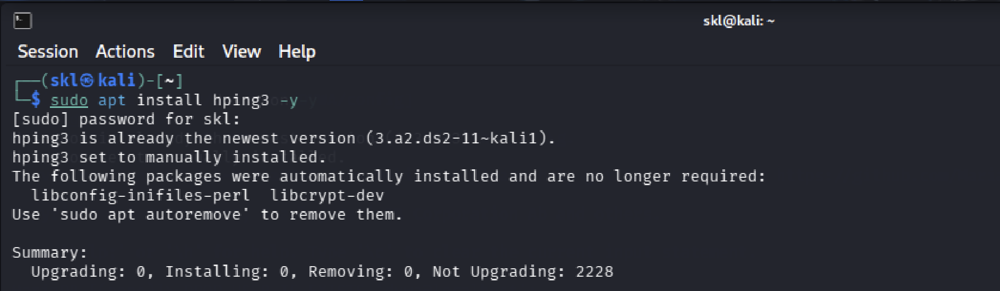

### Basic Packet Test
This test is conducted to verify communication between the testing machine and the target system. It helps confirm that the target is reachable and responding to packet requests.

```bash
sudo hping3 localhost
```

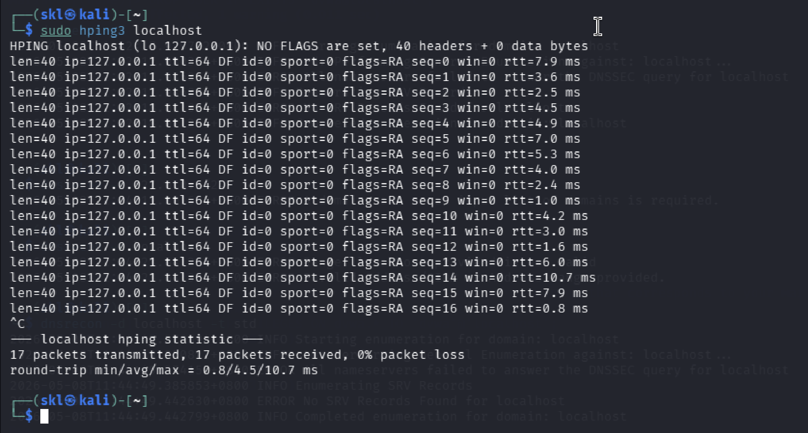

### SYN Packet Test
This test is conducted to send SYN packets to port 80 on the target machine. The purpose of this test is to analyze how the target responds to connection requests and identify active services such as web servers.

```bash
sudo hping3 -S localhost -p 80
```

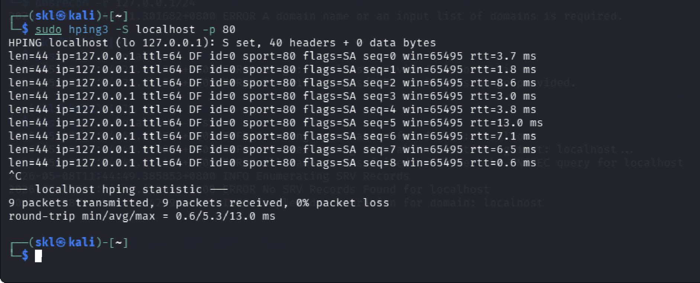

### ICMP Packet Test
This test is conducted to verify whether the target machine responds to ICMP requests. It helps test network connectivity and response behavior between systems.

```bash
sudo hping3 --icmp localhost
```

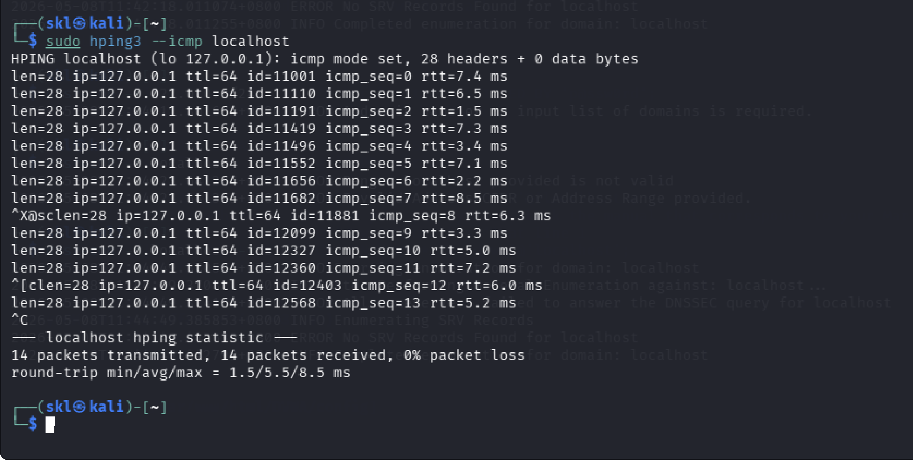

### Conclusion
Hping3 successfully tested network communication and packet responses from the localhost target. The tool is useful during penetration testing because it helps analyze how the target system handles different network packet requests.

---
## Tool 3 — DNSRecon

DNSRecon is a DNS enumeration tool used during the reconnaissance phase in penetration testing. It helps gather DNS-related information from the target system such as domain records, nameserver information, and DNS configurations. This information helps penetration testers understand the target environment before conducting further security testing.

### Installing DNSRecon
This step installs the DNSRecon tool in Kali Linux before starting DNS enumeration and reconnaissance activities.

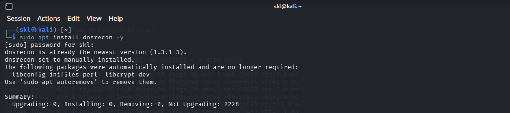

### General DNS Enumeration
This test is conducted to gather general DNS-related information from the target domain. The purpose of this test is to identify available DNS records and understand the DNS configuration used by the target environment.

```bash
dnsrecon -d localhost
```

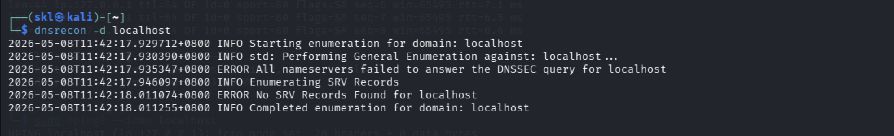

### Standard DNS Enumeration
This test is conducted to perform standard DNS enumeration against the target domain. The command helps identify DNS-related configurations and verify available DNS services used by the target machine.

```bash
dnsrecon -d localhost -t std
```

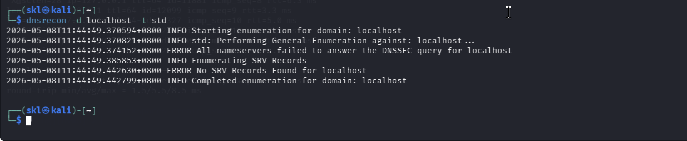

### Conclusion
DNSRecon successfully performed DNS reconnaissance activities against the localhost target. The tool is useful during penetration testing because it helps collect DNS information and improves understanding of the target environment before conducting further assessments.

---
## Tool 4 — Recon-ng

Recon-ng is a web reconnaissance framework used during penetration testing to automate information gathering and reconnaissance activities. The framework helps penetration testers organize reconnaissance tasks, manage workspaces, and use different modules for collecting target information efficiently.

### Installing Recon-ng
This step installs the Recon-ng framework in Kali Linux before starting reconnaissance and information gathering activities.

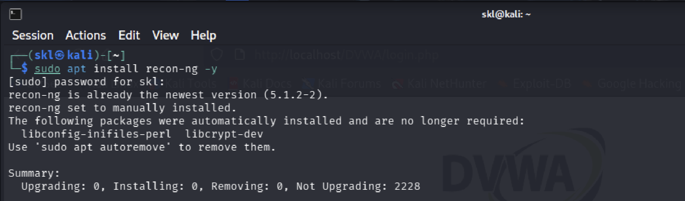

### Starting Recon-ng Framework
This step is conducted to launch the Recon-ng framework environment before using its reconnaissance modules and workspace management features.

```bash
recon-ng
```

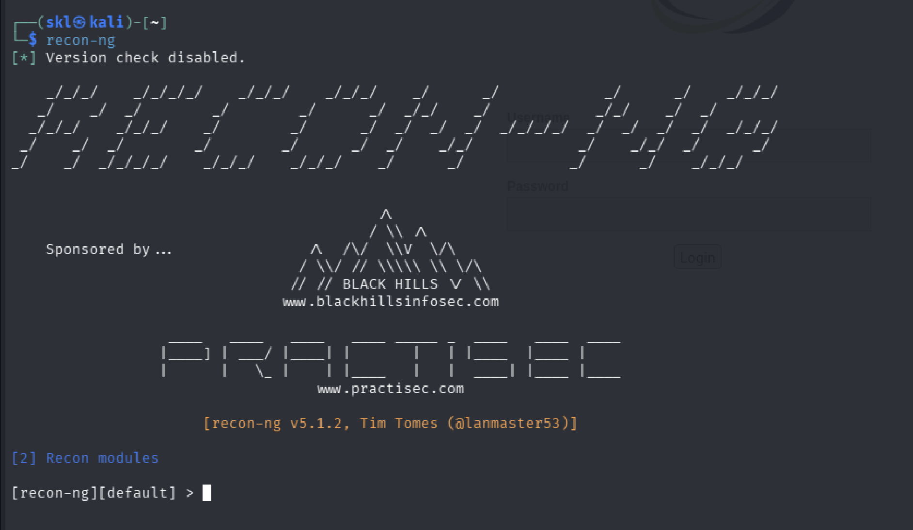

### Marketplace Search
This command is used to search available reconnaissance modules inside the Recon-ng framework. The purpose of this step is to identify useful modules that can be used for information gathering and reconnaissance activities.

```bash
marketplace search
```

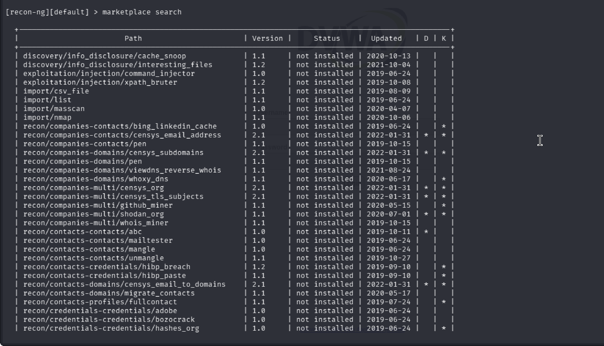

### Workspace Management
This command is used to display existing workspaces and create a dedicated workspace for the target assessment. Workspaces help organize reconnaissance activities and separate project data properly.

```bash
workspaces list
workspaces create dvwa
```

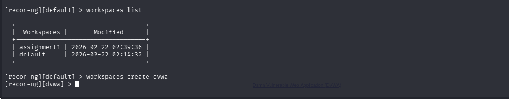

### Conclusion
Recon-ng successfully provided a structured framework for managing reconnaissance activities and organizing information gathering tasks. The framework is useful during penetration testing because it helps automate reconnaissance processes and improve workflow management.
